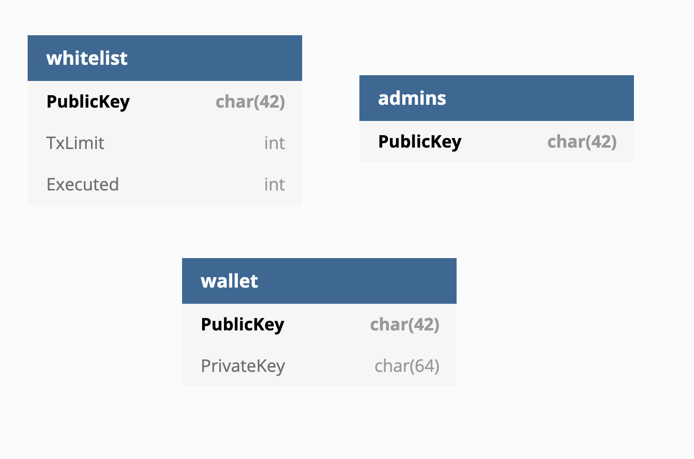

# Govern TX

The govern-tx package does include the transaction service of the govern project. 
This service can get deployed on any server or cloud infrastructure who has nodejs installed.

## Commands

- ``yarn dev`` - Starts the docker containers and the server in dev mode
- ``yarn start`` - Starts the docker containers and the server in production mode
- ``yarn start:server`` - Starts the server without starting the docker containers
- ``yarn start:containers`` - Starts the docker containers
- ``yarn stop:containers`` - Stops the docker containers
- ``yarn test`` - Does execute the unit and e2e tests of this package

## Postgres DB diagramm



## Directory Structure

Overall are the thoughts to have a modularized structure with the separation between abstract classes and concrete implementations with ``lib`` and ``src``.
Means ``lib`` and ``src`` should (If abstraction is required for all module) have the same base structure. This is important to increase the readability. 

```
# All concrete implementations are located in the ./src/ folder
./src/

# Authentication handler used in the fastify pre-handler
./src/auth

# Configratuon object with the required validations of the input
./src/config

# DB wrapper and entities used in the server actions
./src/db

# Provider class used to connect to a Ethereum node
./src/provider

# All transactions related action commands
./src/transactions

# The wallet we use to sign the transactions 
./src/wallet

# All whitelist related CRUD action commands
./src/whitelist

# This class is used to boot the entire server and is used in ./src/index.ts
./Bootstrap.ts

# All abstract classes and helpers are located in the ./lib/ folder
./lib/

# Base abstraction for all actions
./lib/AbstractAction.ts

# Base abstraction for all transaction related actions and VO for contract function encoding
./lib/transactions

# Base abstraction for all whiteliste related CRUD actions
./lib/whitelist

# Home of all tests (e2e & unit)
./test
```
